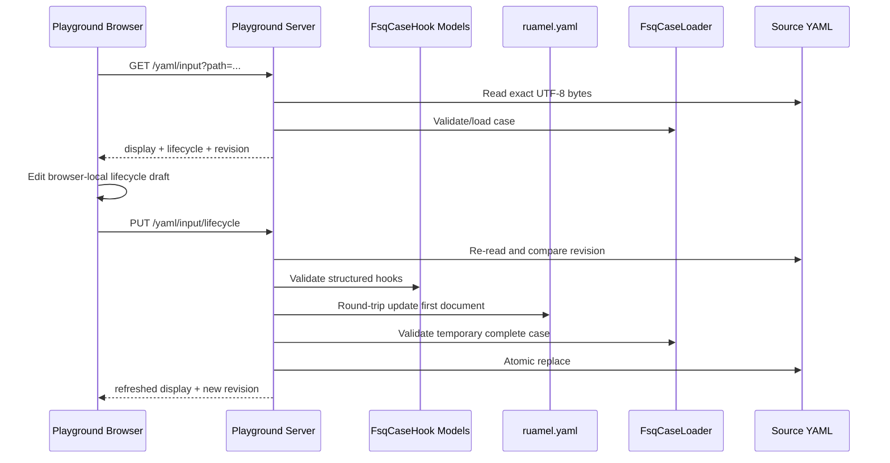

# Playground YAML Lifecycle Editor Design

## Goal

Extend the Playground Input YAML view so loading a `.codex.yaml` case presents its `onCaseStart` and `onCaseComplete` lifecycle hooks and allows users to add, edit, delete, and reorder those hooks before explicitly saving them back to the source file.

The editor must preserve existing FSQ lifecycle semantics, preserve unrelated YAML formatting and comments as far as the selected round-trip library supports, prevent accidental overwrites of externally changed files, and leave ordinary command steps read-only.

## Scope

### In scope

- Display case-level `onCaseStart` and `onCaseComplete` hooks returned by `GET /yaml/input`.
- Edit lifecycle hooks only in the Input YAML view.
- Add, edit, delete, and reorder `runCase` and `runShell` actions inside each lifecycle section.
- Allow repeated `runCase` or repeated `runShell` actions while preserving authored action order.
- Maintain browser-local draft state until the user chooses Save or Discard.
- Validate hook structure and the complete FSQ case before replacing the source file.
- Preserve unrelated YAML content through round-trip parsing and atomic replacement.
- Detect source changes made after loading and reject stale saves.

### Non-goals

- Editing ordinary FSQ command steps.
- Editing general case metadata such as name, platform, tags, app id, or properties.
- Editing Recorded YAML or YAML displayed from a loaded historical run.
- Editing config-level `caseLifecycle` hooks.
- Executing lifecycle hooks from the editor.
- Changing lifecycle execution order, recursion handling, shell execution, or strict-run failure policy.
- Building a general-purpose YAML source editor.
- Auto-saving on each edit.

## Confirmed Decisions

- Edits use browser-local draft state and an explicit Save action.
- Each lifecycle field has one editor section containing one ordered action list; action types may repeat.
- Only case-level lifecycle hooks are editable in this cycle.
- Removing the last hook removes the corresponding lifecycle key instead of writing an empty list.
- YAML write-back uses `ruamel.yaml` round-trip mode.
- The editor is embedded in the Input YAML presentation rather than placed in a modal.

## Architecture

### Python architecture level

The existing `playground` module remains a Level 3 Layered Application. The feature adds one HTTP mutation workflow and one browser editing surface but does not justify a new package, repository abstraction, or persistence layer.

The existing `fsq` module remains a Level 2 Simple Package and retains ownership of complete FSQ case loading and semantic validation. The existing `models` module retains ownership of `FsqCaseHook` and `FsqCaseHookAction` validation.

### Module ownership

#### `playground`

Owns:

- Input YAML lifecycle presentation data.
- The lifecycle draft/save browser workflow.
- Safe resolution of the input YAML path using the same policy as `GET /yaml/input` and execution.
- Revision comparison.
- Round-trip mutation of the first YAML document.
- Temporary-file validation and atomic source replacement.
- HTTP error shaping.

Does not own:

- Lifecycle hook syntax rules.
- Full FSQ case semantics.
- Hook execution.
- Strict execution lifecycle ordering.

#### `models`

Existing `FsqCaseHook` and `FsqCaseHookAction` remain the shared validation boundary. Playground converts each editor action into one single-action `FsqCaseHook`, preserving list order and allowing repeated action types without changing FSQ execution semantics. No new public lifecycle model is required.

#### `fsq`

`FsqCaseLoader` remains the authoritative complete-case validator. Playground must not duplicate its metadata, document-shape, or lifecycle validation rules.

### Dependency change

Add `ruamel.yaml` as a project dependency for round-trip YAML mutation. PyYAML remains available for current read-only presentation parsing unless implementation demonstrates that sharing the round-trip parser reduces complexity without changing display behavior.

## Public Behavior

### Input YAML presentation

The Input YAML display order becomes:

1. Case title.
2. Case summary metadata.
3. `Before case` lifecycle section for `onCaseStart`.
4. `Case steps` heading and read-only ordinary YAML command steps.
5. `After case` lifecycle section for `onCaseComplete`.

Both lifecycle sections render even when empty while editing is available. An empty section shows an Add control and a concise empty state.

The lifecycle sections are hidden from Recorded YAML and loaded-run presentations unless a later read-only display requirement explicitly adds them. No edit controls appear outside the live Input YAML view.

### Hook entry editor

Each lifecycle section contains one ordered list of compact action rows. There are no nested hook-entry cards.

Each action row contains:

- An action-type menu with `runCase` and `runShell`.
- A single-line value input.
- A delete icon button.
- Up/down icon buttons when reordering is possible.

Each row contains its one-based position and can independently select either action type. Duplicate action types are allowed in the same section. Each section has one Add action command; a new row defaults to `runCase` with an empty value and can be changed before save.

### Draft and controls

Loading Input YAML initializes a lifecycle draft from the server response and records the source revision.

Any lifecycle edit marks the Input YAML draft dirty and reveals or enables:

- Save.
- Discard.

Save is disabled when:

- No lifecycle changes exist.
- A save is in flight.
- The Playground is executing or finalizing a run.

Client-side structural validation runs when Save is clicked. Invalid drafts remain editable and produce their validation message only after that command.

Discard restores the lifecycle draft to the last successfully loaded or saved server representation without changing the source file.

Changing the YAML path or reloading while dirty requires confirmation before discarding the draft. Starting an execution while dirty is blocked with a concise instruction to Save or Discard first. Clear discards the draft as part of resetting the workspace.

### Client-side validation

The browser performs immediate structural checks for usability:

- Every hook has at least one action.
- Every action value is non-empty after trimming.
- Action types are supported and unique within one hook.

Client validation improves feedback only. Server validation remains authoritative.

## HTTP Interface

### `GET /yaml/input`

The endpoint retains its existing path resolution, size limit, content, and display behavior. Its successful response adds:

```json
{
  "revision": "sha256:<hex>",
  "editable": true,
  "display": {
    "metadata": {},
    "lifecycle": {
      "onCaseStart": [
        {"index": 1, "action": "runCase", "value": "hooks/login.codex.yaml"},
        {"index": 2, "action": "runCase", "value": "hooks/seed.codex.yaml"},
        {"index": 3, "action": "runShell", "value": "echo ready"}
      ],
      "onCaseComplete": []
    },
    "steps": []
  }
}
```

`revision` is the SHA-256 digest of the exact UTF-8 source bytes returned as `content`. It is an opaque concurrency token to the browser.

`editable` is true only for a resolved live input case file that is within the existing allowed input path policy and when no server-level condition permanently prevents editing. Busy state remains dynamic and is enforced during save.

Lifecycle presentation is generated from validated lifecycle models so combined action order matches the source.

### `PUT /yaml/input/lifecycle`

Request:

```json
{
  "path": "sample.codex.yaml",
  "revision": "sha256:<hex>",
  "onCaseStart": [
    {"action": "runCase", "value": "hooks/login.codex.yaml"},
    {"action": "runCase", "value": "hooks/seed.codex.yaml"},
    {"action": "runShell", "value": "echo ready"}
  ],
  "onCaseComplete": []
}
```

The endpoint accepts only structured lifecycle data, not arbitrary YAML text.

Successful response:

- Returns the same normalized input YAML response shape as `GET /yaml/input`, including new content, presentation, and revision.
- Allows the browser to replace its source snapshot and clear dirty state without a second request.

Status behavior:

- `200`: saved and reloaded successfully.
- `400`: malformed request, invalid hook data, invalid complete FSQ case, unsupported YAML shape, or encoding/serialization failure.
- `404`: source file no longer exists.
- `409`: Playground is busy/finalizing or revision does not match current source bytes.
- `413`: current source or resulting file exceeds the existing YAML display/edit size limit.
- `500`: atomic write failure or unexpected server failure, with no traceback in the response.

The response for revision conflict states that the file changed on disk and instructs the user to reload. The current draft remains visible in the browser so the user can inspect it before choosing reload/discard.

## Save Flow

1. Resolve `path` through the same helper and candidate order used by `GET /yaml/input`.
2. Reject save while execution or completion/replay finalization is active.
3. Read exact current bytes and enforce the existing size limit and UTF-8 policy.
4. Compute the current revision and compare it with the request revision.
5. Validate each requested action through `FsqCaseHookAction`, wrap it as one single-action `FsqCaseHook`, and preserve list order.
6. Parse the complete source with `ruamel.yaml` round-trip mode and require a mapping first document.
7. Replace only `onCaseStart` and `onCaseComplete` in the first document.
8. Delete a lifecycle key when its requested list is empty.
9. Preserve the relative position of an existing lifecycle key. For a newly added key, insert `onCaseStart` before `onCaseComplete` when both exist and otherwise place lifecycle fields after general case metadata/properties and before the document separator.
10. Serialize all documents to a temporary file in the source directory using UTF-8 and the source newline convention when practical.
11. Load the temporary file through `FsqCaseLoader` to validate the complete FSQ case and lifecycle semantics.
12. Enforce the resulting size limit.
13. Flush and atomically replace the source with `os.replace`.
14. Re-read the saved source and return a fresh input YAML response.
15. Clean up the temporary file on every failure path.

If any step before atomic replacement fails, the original source remains untouched.

## YAML Preservation

Round-trip write-back should preserve, where supported by `ruamel.yaml`:

- Comments.
- Mapping key order.
- Scalar quote style.
- Flow/block collection style.
- Document separators.
- Unedited metadata and command content.

The feature guarantees semantic preservation of unrelated content, not byte-for-byte preservation after a save. Tests should focus on representative comment/order/style preservation and exact semantic equality of the command document.

Lifecycle keys that originally use single-mapping shorthand or combined mappings may be normalized after editing to list form with one action mapping per list item. Files loaded and saved without lifecycle edits are never rewritten.

## Error Handling and Edge Cases

- Malformed YAML cannot enter edit mode; existing display parse errors remain unchanged.
- A single-document goal-only case may edit lifecycle hooks and remains single-document after save.
- A two-document case preserves its command document and separator.
- Unknown lifecycle actions and empty values are rejected before write. Repeated action types are valid.
- `runCase` values are validated as non-empty strings but are not resolved or executed during editing.
- `runShell` values are stored as authored strings and never executed during editing.
- Symlink/path escape policy matches existing input resolution. Saving must not broaden writable paths beyond files already accepted as input cases.
- A deleted or moved file returns `404`.
- A source changed by another editor returns `409` and is not overwritten.
- A save interrupted before `os.replace` leaves the original file intact.
- Recorded YAML, generated run files, and loaded-run YAML remain read-only.

## UI State and Accessibility

- Lifecycle section headings are compact and match the existing operational YAML viewer rather than introducing nested cards.
- Add, delete, and reorder controls use the existing icon library when available or familiar symbols with accessible labels and tooltips.
- Menus are used for action type selection; text inputs are used for action values.
- Save and Discard are clear text commands because they are document-level operations.
- All icon controls have `aria-label` and tooltip text.
- Keyboard users can tab through hooks, change action type, edit values, reorder through buttons, add/delete, Save, and Discard.
- Text must wrap or scroll within the existing resizable YAML panel without overlapping controls.

## Data and Control Flow



## Affected Specifications

Expected SPEC updates during `spec-driven`:

- `fsq_agent/playground/SPEC.md`
  - Extend `GET /yaml/input` presentation contract.
  - Add `PUT /yaml/input/lifecycle`.
  - Update static UI behavior, error handling, internal ownership, dependency note, and testing contract.

No FSQ lifecycle semantics change is expected, so `fsq_agent/fsq/SPEC.md` and `fsq_agent/models/SPEC.md` should remain unchanged unless implementation reveals a missing public contract.

Root `SPEC.md` should require synchronization only if its project-level Playground summary or dependency list needs to mention editable lifecycle metadata. Avoid adding interaction-level details to root SPEC.

## Verification Expectations

### Server tests

- Input presentation includes ordered `onCaseStart` and `onCaseComplete` entries.
- Omitted lifecycle fields return empty lists.
- Combined hook actions preserve authored order.
- Save adds, edits, deletes, and reorders hook entries/actions.
- Empty lifecycle lists remove their keys.
- Command document remains semantically unchanged.
- Representative comments, key order, quotes, and document separators survive round-trip save.
- Complete case validation uses `FsqCaseLoader` and rejects invalid results without modifying the source.
- Revision conflicts return `409` without modifying the source.
- Busy/finalizing saves return `409`.
- Missing, unsafe, directory, oversized, and malformed inputs return structured errors.
- Atomic-write failure leaves the original source intact.
- Recorded and loaded-run YAML have no mutation endpoint.

### Static UI tests

- Input YAML renders Before case and After case in the correct positions.
- Existing combined mappings flatten into action rows in authored order.
- Add/edit/delete/reorder, including repeated action types, mutate only browser draft state.
- Save sends the expected structured request and applies the refreshed response.
- Discard restores the last server snapshot.
- Dirty state blocks execution/path replacement until Save or Discard.
- Conflict and validation errors preserve the draft and appear once in the YAML status surface.
- Edit controls are absent for Recorded YAML and loaded historical runs.
- Controls disable during execution, finalization, and save.

### Commands

- `python -m pytest tests/test_playground.py`
- Focused FSQ regression when save validation is integrated: `python -m pytest tests/test_fsq.py tests/test_fsq_executable_step_adapter.py`
- Full relevant suite if dependency or shared path helpers change.
- Browser interaction verification at desktop and narrow/mobile viewport using the running Playground, including no overlap in lifecycle cards and save/discard flows.

## Resolved Questions

- Persistence: explicit Save to source YAML.
- Hook shape: one ordered action list per lifecycle field; action types may repeat.
- Editable scope: case-level lifecycle hooks only.
- Empty lifecycle behavior: remove the key.
- YAML write-back: `ruamel.yaml` round-trip mode.
- UI placement: embedded in Input YAML between case metadata and ordinary commands.
