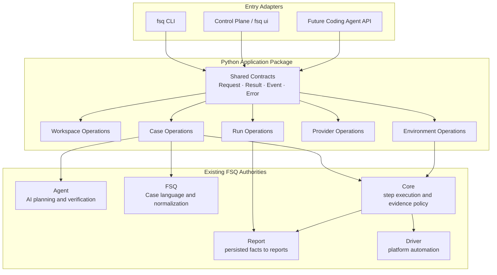

# FSQ Next-Generation CLI Design

**Status:** Confirmed revision for internal review
**Date:** 2026-08-14

## Goal

Design FSQ's next-generation command-line interface as a stable entry point for people, CI, and Coding Agents, while establishing a transport-neutral Python Application API shared by the CLI, Control Plane, and future Agent-facing adapters.

This revision defines the public CLI interface and the shared application boundary. It deliberately does not design the internal workflow of each command.

## Scope

This design covers:

- The first-phase public `fsq` command tree.
- Goal-driven Case creation and existing Case testing.
- The single public Case asset suffix `*.fsq.yaml`.
- Optional AI suggestions after testing an existing Case.
- Workspace preconditions for public commands.
- Human, JSON, and JSONL interfaces for people and Coding Agents.
- A real Python Application package shared by CLI, Control Plane, and future Coding Agent APIs.
- Transport-neutral Application Operations, Request, Result, Event, and Error contracts.
- Ownership boundaries between Application and the existing Agent, FSQ, Core, Report, and Driver modules.
- The first-phase Provider, Run, and Environment command surfaces.
- Breaking command and Case-file migration.

## Non-goals

This design does not decide:

- The detailed internal workflow of `init`.
- Whether `case create`, `case test`, and `--suggest` are implemented as separate internal use-case classes.
- The detailed execution timing, persistence model, or failure semantics of suggestions.
- Concrete Python class names or the final file layout inside the Application package.
- Internal Run, Environment, Provider, or resource lifecycle algorithms.
- A public Extension protocol or installation mechanism.
- Public Action, Capability, or Operation discovery.
- A daemon, background queue, remote control plane, or detached execution.
- Parallel workers, sharding, test matrices, or cross-Case shared sessions.
- Environment creation, deletion, inspection, or cleanup commands.
- Run cancellation or deletion commands.
- Automatic modification of source Case files.

## Design Principles

1. **Organize commands around the Case resource.** Users create Cases from Goals and test existing Cases.
2. **Use one public Case format.** `*.fsq.yaml` is the only new Case asset type; no separate Intent format is introduced.
3. **Humans and Coding Agents share one CLI.** Machine consumers select a versioned output protocol rather than a separate command tree.
4. **CLI and UI share application semantics.** Entry adapters must not independently orchestrate FSQ workflows.
5. **Application is a real boundary, not a diagram label.** A Python Application package exposes transport-neutral operations and contracts.
6. **Application composes existing authorities.** It does not duplicate AI planning, Case parsing, step execution, report interpretation, or platform automation rules.
7. **Current directory is explicit context.** Commands do not search parent directories for a Workspace.
8. **Platform remains explicit.** Relevant commands require `--platform`; omitted Environment continues to mean `local`.
9. **Source Cases remain immutable.** AI output is written as suggestions or Run-local candidates, never silently over source files.
10. **First-phase contracts stay intentionally small.** Extension and discovery APIs remain future work.

## Public Command Tree

```text
fsq [GLOBAL OPTIONS]
├── init
├── doctor
├── case
│   ├── create
│   └── test
├── ui
├── providers
│   ├── list
│   ├── configure NAME
│   └── status [NAME]
├── runs
│   ├── list
│   ├── show RUN_ID
│   └── logs RUN_ID
└── environments
    ├── list
    └── doctor NAME
```

The first phase does not expose `extensions`, operation discovery, Environment mutation, or Run mutation commands.

## Core Case Interfaces

### Create a Case from a Goal

```bash
fsq case create --platform web --goal "Verify product search"
```

Public meaning:

- The user supplies a natural-language Goal.
- AI participates in testing the real target.
- Successful execution may produce a Run-local candidate `*.fsq.yaml`.
- The command does not overwrite an existing Case.

Important public options expected in the first phase include:

- `--platform PLATFORM`: required.
- `--goal TEXT`: required Goal input.
- `--environment NAME`: defaults to `local`.
- `--record/--no-record`: controls candidate Case generation; success records by default.
- `--stream/--no-stream`: controls live event presentation.
- `--timeout DURATION`: accepts forms such as `30s`, `5m`, and `1h`.
- `--max-steps N`: bounds external Agent operations.
- `--dry-run`: validates public preconditions without operating a target.

The exact internal stages, internal use-case decomposition, and candidate-generation algorithm are deferred.

### Test an Existing Case

```bash
fsq case test --platform web tests/search.fsq.yaml
```

Public meaning:

- The input is an existing `*.fsq.yaml` Case or a directory of Cases.
- The Case is executed as the regression-test authority.
- The source Case is not modified.
- An explicitly authored AI assertion remains part of the Case contract where supported.

Important public options expected in the first phase include:

- `CASE`: required `*.fsq.yaml`, migration-period `*.codex.yaml`, or directory.
- `--platform PLATFORM`: required and must agree with the Case.
- `--environment NAME`: defaults to `local`.
- `--suggest`: requests AI analysis and optional candidate improvements without overwriting the source Case.
- `--timeout DURATION`: bounds one Case test.
- `--fail-fast`: stops directory testing after the first unsuccessful child.
- `--dry-run`: validates discovery and public preconditions without operating a target.

The detailed relationship between the original Case result and the suggestion result is deferred. The eventual implementation must preserve the original test facts and must not silently turn a failed Case into a pass.

### Suggestion Boundary

The public contract for `--suggest` is intentionally limited:

- it is available only while testing an existing Case;
- it may emit structured suggestions and a Run-local candidate Case;
- it never overwrites the source `*.fsq.yaml`;
- it must preserve the original Case test facts;
- its internal timing, status model, and use-case decomposition are future design items.

## Case Assets

New Case assets use:

```text
*.fsq.yaml
```

No `*.intent.yaml` or `fsq.test-intent/v1` format is introduced. Natural-language intent enters through `case create --goal`. Existing Cases enter through `case test`.

For one deprecation cycle, Case testing and lifecycle references may accept `*.codex.yaml`. New candidates, examples, and documentation use `*.fsq.yaml`. The system does not automatically rename old files. The exact removal release remains a release-policy decision.

Directory Case discovery is recursive, contained below the requested root, does not follow directory symlinks, and uses stable relative-path ordering. Empty discovery is an input error. Duplicate new/legacy Case identification requires a precise rule during the later SPEC phase.

## Workspace Preconditions

With the exception of `fsq init`, public commands require the current directory to contain a valid initialized Workspace at:

```text
.fsq-agent-workspace
```

When the Workspace is missing or invalid, the command must:

- fail before creating Runs, output directories, external sessions, VMs, or device actions;
- not search parent directories;
- not initialize automatically;
- tell the user to run `fsq init` or change to the intended initialized Workspace directory;
- expose stable structured error code `workspace.not_initialized`;
- map the condition consistently in Human, JSON, JSONL, CLI exit status, and UI responses.

**TODO — Init design:** This revision intentionally does not redesign `fsq init`. Its responsibilities, parameters, Workspace creation flow, idempotency, and migration behavior require a separate design discussion.

## Global CLI Contracts

| Option | Behavior |
|---|---|
| `--output human\|json\|jsonl` | Selects the output protocol; default is `human`. |
| `--non-interactive` | Prohibits prompts, confirmations, and interactive authentication. |
| `--quiet` | Reduces Human output without removing required errors. |
| `--verbose`, `-v` | Increases safe diagnostics and may be repeated. |
| `--color auto\|always\|never` | Controls Human terminal color. |
| `--version` | Reports FSQ and protocol versions. |
| `--help` | Provides help at every command level. |

`json` emits one final result. `jsonl` emits versioned events and ends with a terminal command event carrying an equivalent final result. Structured stdout contains protocol records only; safe diagnostics go to stderr. Commands without meaningful progress emit one terminal JSONL record.

The shared result envelope includes a schema version, operation/command identity, status, timestamp, safe data, warnings, and a structured error with stable code, category, message, next action, and bounded redacted details.

## Supporting Public Interfaces

### `fsq doctor`

Diagnoses the selected platform and Environment without provisioning paid or remote resources. Its detailed checks remain a later command-level design topic.

### `fsq ui`

Starts the official Control Plane adapter. It must consume the same Application API as the CLI rather than reimplement Case, Run, Provider, or Environment semantics. Non-loopback security and detailed UI startup options remain governed by the later public-interface specification.

### `fsq providers`

First-phase interfaces remain:

```text
providers list
providers configure NAME
providers status [NAME]
```

Provider configuration remains current-directory-oriented and must never expose Secret values. Detailed authentication flows remain command-level design work after the shared framework is confirmed.

### `fsq runs`

First-phase interfaces remain:

```text
runs list
runs show RUN_ID
runs logs RUN_ID
```

They expose the same application-level Run facts to CLI and UI. Detailed persistence layout, filtering, and lifecycle behavior are deferred.

### `fsq environments`

First-phase interfaces remain:

```text
environments list --platform PLATFORM
environments doctor --platform PLATFORM NAME
```

The public CLI selects Environment Profiles without exposing Provider-specific switches. Detailed Local/Tart lifecycle implementation remains outside this revision.

## Shared Application Architecture

### Decision

`Shared Application Services` is both an architecture layer and a real Python package in the repository. The package is the shared, transport-neutral application boundary used by the CLI, Control Plane, and future Coding Agent adapters.

The package exposes Application Operations grouped by resource domain:

- Workspace Operations
- Case Operations
- Run Operations
- Provider Operations
- Environment Operations

It also exposes or consistently consumes shared application contracts:

- Request
- Result
- Event
- Error
- Operation status and safe artifact references where applicable

This design does not require one class per operation and does not decide the final package-internal file layout.



The arrows show permitted application composition, not mandatory direct calls for every operation and not one class per box.

### Why a Real Package

If Application exists only as a diagram label, the CLI and Control Plane can each continue to load configuration, validate inputs, start execution, map states, and find artifacts independently. Their behavior will eventually diverge even if both call the same low-level modules.

A real package makes the dependency boundary enforceable:

```text
CLI adapter ─────────┐
Control Plane adapter├──> Application API ──> existing FSQ authorities
Future Agent adapter ┘
```

CLI and UI should share application semantics, not transport objects.

### Shared vs Adapter-specific Concerns

| Shared Application contract | CLI adapter | Control Plane adapter |
|---|---|---|
| Request | Click argument mapping | HTTP request mapping |
| Result | Human/JSON/JSONL rendering | HTTP response/UI projection |
| Event | stdout/stderr stream | SSE or equivalent transport |
| Error | Exit-code mapping | HTTP status mapping |
| Operation status | Process/SIGINT behavior | Browser task state |

Application contracts must not import or expose Click contexts, HTTP request/response types, SSE payload types, terminal formatting objects, or frontend view models.

## Ownership Boundaries

### What Application Owns

Application owns cross-module application semantics that must be identical for all adapters:

- the public operation boundary and request validation at that boundary;
- current-Workspace context enforcement;
- composition of existing module APIs into one user operation;
- unified application results, events, statuses, and errors;
- safe artifact references and adapter-independent next actions;
- consistent behavior across CLI, Control Plane, and future adapters.

### What Application Does Not Re-own

Application may call the existing modules, but it does not copy, reinterpret, or replace their authoritative rules:

- **Agent** continues to own AI planning, model tool-use orchestration, dynamic execution guidance, and evidence-based dynamic verification.
- **FSQ** continues to own Case-file recognition, YAML/DSL parsing, validation, capability alias resolution, and conversion into canonical executable steps.
- **Core** continues to own capability lookup, parameter and runtime-secret validation, deterministic step/sequence execution, evidence capture policy, Harness routing, and normalized step results.
- **Report** continues to own transformation of persisted execution facts into standard reports and failure analysis.
- **Driver** continues to own concrete platform automation and backend error normalization.

Application owns the statement "compose the appropriate authorities for this user operation." It does not own alternative implementations of YAML parsing, tool execution, screenshot policy, report semantics, or device automation.

### No Giant Facade

The Application package must not collapse into a single catch-all interface such as:

```python
application.execute(command)
```

or a giant service object containing every command. Operations are grouped by resource domain so adapters depend only on the capabilities they use. The exact internal use-case granularity remains deferred.

### Adapter Dependency Rule

New CLI and Control Plane business operations must go through the Application API. Adapters must not bypass Application to recreate shared validation, orchestration, state mapping, or artifact discovery. Narrow transport-only concerns remain in the adapter.

Existing low-level authorities must not import the Application package. Dependency direction is from adapters to Application to existing modules.

## Extension Boundary

This revision does not define a public Extension API. It records only an architectural constraint for future work:

- extensions will most naturally appear below the Application layer, including Model Providers, Environment Providers, Drivers, Report exporters, and carefully governed capabilities;
- extensions must not require CLI-only business orchestration that has no equivalent Application Operation for UI and Agent adapters;
- extending public Application Operations is a separate future design because it requires transport-neutral schemas, compatibility, permissions, discovery, and security rules.

No Extension installation or discovery command is committed by this design.

## Existing Module Locations and Roles

| Authority | Current location | Role retained beneath Application |
|---|---|---|
| Agent | `fsq_agent/agent/` | Goal planning, SDK tool orchestration, dynamic execution, verification |
| FSQ | `fsq_agent/fsq/` | Case DSL parsing, validation, and canonical step adaptation |
| Core | `fsq_agent/core/` | Capability registry, deterministic execution, evidence, Harness/Driver routing |
| Report | `fsq_agent/report/` | Persisted facts to Markdown/JSON reports and failure analysis |
| Drivers | `fsq_agent/core/harness/` | Concrete Playwright, UIAutomator2, Appium Mac2, and pywinauto automation |

The later SPEC phase must define the Application module's public imports and verify that existing authorities remain the single rule owners.

## Machine Protocol and Exit Categories

The previously agreed direction remains:

- `--output human|json|jsonl` is global.
- JSON emits one final application Result.
- JSONL emits versioned Events and one terminal Result event.
- stdout contains structured protocol data only in machine modes.
- Secrets and hidden reasoning never appear in outputs.

Top-level CLI exit categories remain:

| Code | Meaning |
|---:|---|
| `0` | Operation succeeded; tested behavior passed where applicable. |
| `1` | Case test completed but failed or was inconclusive. |
| `2` | CLI usage, Case input, discovery, or schema error. |
| `3` | Workspace, configuration, authentication, Provider, or Environment not ready. |
| `4` | Driver, device, network, VM, or remote infrastructure failure. |
| `5` | FSQ internal error. |
| `130` | User interruption. |

Application Error is the shared semantic fact. CLI maps it to an exit code; Control Plane maps it to an HTTP/status response.

## Compatibility and Migration

The primary executable becomes `fsq`; `fsq-agent` may temporarily point to the same new command tree. New documentation uses `fsq`.

Old command forms are not silently forwarded:

| Removed form | New interface |
|---|---|
| `fsq-agent run --goal ...` | `fsq case create --goal ...` |
| `fsq-agent run --case-yaml ...` | `fsq case test CASE` or create a Case from a Goal |
| `fsq-agent run --strict --case-yaml ...` | `fsq case test CASE` |
| `fsq-agent report --run-id ...` | `fsq runs show RUN_ID` |
| `fsq-agent control-plane` | `fsq ui` |
| `fsq-agent playground` | No first-phase public replacement |

Removed commands return a usage error and a migration action rather than guessing intent. Existing `.fsq-agent-workspace` and configured output roots remain migration concerns. The exact removal release for `fsq-agent` and `*.codex.yaml` remains open.

## Verification Expectations

The later implementation must verify:

- the complete command/help hierarchy and public option mapping;
- current-directory Workspace enforcement on every command except `init`;
- no parent-directory Workspace discovery or automatic initialization;
- Goal-to-Case and existing-Case public input separation;
- `--suggest` never overwrites the source Case and preserves original test facts;
- `*.fsq.yaml` discovery and migration-period legacy behavior;
- identical Application Result, Event, and Error semantics across CLI and Control Plane adapters;
- clean mapping from shared Application errors to CLI exit codes and UI/HTTP status;
- no Click/HTTP/frontend types in the Application API;
- no Application logic duplicated in CLI or Control Plane;
- no duplicate Agent, FSQ, Core, Report, or Driver rule implementation in Application;
- Human, JSON, and JSONL output consistency and redaction;
- source-checkout and isolated-wheel behavior.

Expected repository checks remain:

```bash
pytest
ruff check .
ruff format --check .
npm test
npm run build
```

## Affected Specifications

The later `/spec-driven` phase is expected to evaluate at least:

- `SPEC.md` for public command, module-map, dependency, and file-naming changes.
- A new Application module `SPEC.md` if the confirmed module does not yet exist.
- `fsq_agent/cli/SPEC.md` for the public CLI and adapter boundary.
- `fsq_agent/models/SPEC.md` for shared serializable application boundary models where appropriate.
- `fsq_agent/control_plane/SPEC.md` and `frontend/control-plane/SPEC.md` for Application API consumption and renamed Case operations.
- `fsq_agent/agent/SPEC.md`, `fsq_agent/fsq/SPEC.md`, `fsq_agent/core/SPEC.md`, and `fsq_agent/report/SPEC.md` for dependency direction and retained ownership.
- `fsq_agent/config/SPEC.md`, Provider, and Environment specifications where the public interfaces require change.

## Resolved Decisions

- Public Case operations are `fsq case create` and `fsq case test`.
- `fsq case test --suggest` requests optional AI suggestions without source overwrite.
- No `test`, `replay`, or `*.intent.yaml` public model remains.
- `*.fsq.yaml` is the single new Case asset suffix.
- Except for `init`, commands require an initialized Workspace in the current directory.
- Parent-directory Workspace search and automatic initialization are prohibited.
- `init` details are deferred as a separate TODO.
- Shared Application Services is a real Python package and an architecture layer.
- Application Operations are grouped by Workspace, Case, Run, Provider, and Environment.
- CLI, Control Plane, and future Agent adapters share transport-neutral Request, Result, Event, and Error contracts.
- Application composes but does not duplicate Agent, FSQ, Core, Report, or Driver rules.
- Application is not a giant catch-all Facade.
- Detailed internal use-case decomposition is deferred.

## Open Review Questions

1. What exact Python package name and public import surface should carry the Application API?
2. Which contract types belong in Application versus the neutral `models` module?
3. What precise request/result/event/error compatibility policy applies across releases?
4. Which existing CLI and Control Plane composition helpers migrate into Application, and which remain adapter-local?
5. What is the exact public option set for each command after the framework is approved?
6. How is `--suggest` represented in results without changing the original Case test facts?
7. What exact rule identifies duplicate `*.fsq.yaml` and `*.codex.yaml` files?
8. Which release removes the `fsq-agent` executable and legacy Case suffix?
9. What detailed behavior should `fsq init` eventually own?
