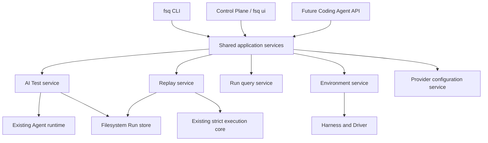

# FSQ Next-Generation CLI Design

**Status:** Confirmed design for internal review
**Date:** 2026-08-13

## Goal

Redesign FSQ's command-line interface as a stable entry point for both people and Coding Agents. The new CLI must make AI-driven testing and deterministic replay unambiguous, expose durable machine-readable results, treat execution environments as extensible providers, and share execution semantics with the Control Plane instead of creating a second orchestration path.

## Scope

This design covers:

- The new `fsq` executable and first-phase public command tree.
- Separate AI Test and deterministic Replay workflows.
- AI Intent and deterministic Workflow file contracts.
- Local persistent Run and Batch Run resources.
- Human, JSON, and JSONL protocols and stable exit codes.
- Provider configuration commands and `.env` security behavior.
- Environment Profiles and a provider lifecycle for Local, Tart, and future cloud devices.
- Control Plane integration through shared application services.
- Breaking command migration and temporary `*.codex.yaml` compatibility.
- Phased delivery and verification expectations.

## Non-goals

The first phase does not provide:

- A daemon, background queue, remote control plane, or detached execution.
- Run cancellation or deletion commands.
- Parallel workers, sharding, test matrices, or cross-case shared sessions.
- Environment create, delete, inspect, or cleanup commands.
- Third-party Extension installation, removal, or a public Extension CLI.
- Public Action, Capability, or Operation discovery commands.
- Cloud device providers such as BrowserStack or Sauce Labs; their integration shape is reserved only.
- Provider or model overrides on `fsq test`.
- A new project-level `fsq.yaml`, project-root search, `--project`, or `--workspace`.
- Automatic modification of source Intent or Workflow files.

## Design Principles

1. **User intent before implementation mode.** `test` means AI participates; `replay` means deterministic execution. No `--strict` mode switch is needed.
2. **One public meaning per file type.** Intent describes what AI should verify; Workflow describes exact replayable steps.
3. **Humans and Agents share one CLI.** Machine consumers select a versioned output protocol rather than using a separate command tree.
4. **Explicit platform, safe environment default.** Platform is always named; omitted Environment always means `local`.
5. **Entry layers stay thin.** CLI and Control Plane use shared application services and existing execution authorities.
6. **Evidence remains first-class.** Every Run exposes reports, evidence, events, and candidate Workflow outcomes consistently.
7. **Provider-specific details do not leak into common commands.** Tart and future cloud settings belong to Environment Profiles.
8. **Safe automation by default.** Non-local resources require explicit selection; diagnostics do not allocate resources; source files are never silently changed.
9. **Stable contracts are introduced deliberately.** First-phase Extension and operation discovery remain internal until their compatibility models are ready.

## Primary Scenarios

### Human users

- Initialize an FSQ workspace in the current directory.
- Configure and inspect an LLM Provider.
- Diagnose whether a platform and Environment can run.
- Run an AI test from a natural-language Goal or structured Intent.
- Deterministically replay one Workflow or a directory of Workflows.
- Inspect past Runs, logs, reports, Evidence, and generated candidate Workflows.
- Use the Control Plane through one official `fsq ui` entry.

### Coding Agents and CI

- Invoke the same operations non-interactively.
- Receive stable JSON results or JSONL progress without parsing human logs.
- Distinguish product failure, invalid input, missing readiness, infrastructure failure, and FSQ defects through exit codes and stable error codes.
- Locate report, Evidence manifest, and candidate Workflow artifacts from the final result.
- Query prior Runs from the current workspace.
- Set the working directory and process environment explicitly without hidden project-root discovery.

## Public Command Tree

```text
fsq [GLOBAL OPTIONS]
├── init
├── doctor
├── test
├── replay
├── ui
├── providers
│   ├── list
│   ├── configure NAME
│   └── status [NAME]
├── runs
│   ├── list
│   ├── show RUN_ID
│   └── logs RUN_ID
└── environments
    ├── list
    └── doctor NAME
```

The first phase does not expose `extensions`, `inspect actions`, Environment mutation, or Run mutation commands.

## Global Options

| Option | Behavior |
|---|---|
| `--output human\|json\|jsonl` | Selects the output protocol; default is `human`. |
| `--non-interactive` | Prohibits prompts, confirmation, and interactive authentication. |
| `--quiet` | Reduces Human output to the final summary without hiding errors. |
| `--verbose`, `-v` | Increases safe diagnostics and may be repeated. |
| `--color auto\|always\|never` | Controls Human terminal color. |
| `--version` | Reports FSQ version, CLI protocol version, and Python version. |
| `--help` | Provides help at every command level. |

`--quiet` does not remove required JSON or JSONL protocol records. In structured modes, stdout contains protocol records only and diagnostics go to stderr.

## Command Design

### `fsq init`

Initializes or validates `.fsq-agent-workspace` in the current directory. It creates required internal directories and identity metadata, is idempotent, and does not select a platform, configure a Provider, create examples, modify platform configuration, or perform complete readiness diagnostics.

Important options:

- `--dry-run`: report safe planned workspace changes without writing.
- `--force`: repair safely reconstructable metadata without overwriting Runs or user files.

### `fsq doctor`

Performs comprehensive, non-provisioning readiness diagnostics.

```bash
fsq doctor --platform web
fsq doctor --platform macos --environment macos-tart
```

Important options:

- `--platform PLATFORM`: required; one of `web`, `android`, `windows`, or `macos`.
- `--environment NAME`: defaults to `local`.
- `--mode test|replay|all`: defaults to `all` and controls whether AI Provider readiness is required.
- `--strict`: treats warnings as diagnostic failure.
- `--timeout DURATION`: bounds each diagnostic.
- `--check NAME`: runs selected checks and may be repeated.
- `--list-checks`: lists available checks without running them.

Doctor checks Workspace, Provider, platform dependencies, Driver/backend, Environment Profile, required environment names, tools/services, output paths, and internal registration health. It does not create a VM, open a cloud session, operate an application, send a model request, incur a paid resource, or fix configuration.

### `fsq test`

Runs an AI-participating test. Exactly one input source is required:

```bash
fsq test --platform web --goal "Verify product search"
fsq test --platform web --goal-file goal.txt
fsq test --platform web --intent tests/search.intent.yaml
fsq test --platform web --intent tests/intents/
```

Inputs:

- `--goal TEXT`: one natural-language Goal.
- `--goal-file PATH`: reads one UTF-8 natural-language Goal.
- `--intent PATH`: accepts one `*.intent.yaml` file or a directory.

Important options:

- `--platform PLATFORM`: required and must match each Intent.
- `--environment NAME`: defaults to `local`.
- `--record/--no-record`: successful Runs record by default.
- `--stream/--no-stream`: Human and JSONL stream by default.
- `--timeout DURATION`: bounds one test. Duration syntax supports values such as `30s`, `5m`, and `1h`.
- `--max-steps N`: limits external Agent operations.
- `--fail-fast`: stops directory execution after the first unsuccessful child.
- `--dry-run`: validates input, configuration, and readiness without calling a model or device.

The AI may plan, locate, recover, and verify. It does not modify Goal files or source Intent files. A successful Run attempts to create `candidate.fsq.yaml` from actually completed replayable operations. Failed and inconclusive Runs do not create candidates by default. Recording failure is reported but does not change the test outcome.

`test` does not expose Provider, model, strict-mode, worker, shard, retry, detach, or Environment-provider-specific options.

### `fsq replay`

Deterministically executes one Workflow or directory.

```bash
fsq replay --platform web tests/search.fsq.yaml
fsq replay --platform web tests/workflows/
```

Important arguments and options:

- `WORKFLOW`: required path to `*.fsq.yaml`, migration-period `*.codex.yaml`, or a directory.
- `--platform PLATFORM`: required and must match every Workflow.
- `--environment NAME`: defaults to `local`.
- `--timeout DURATION`: bounds one Workflow.
- `--fail-fast`: stops a batch after the first unsuccessful child.
- `--dry-run`: validates discovery, schemas, operations, secret references, and readiness without operating a target.

Replay does not construct AI planning, repair, locator fallback, or recovery. An explicitly authored AI assertion is the sole Provider-backed exception. Replay never modifies its input.

### `fsq ui`

Starts the official Control Plane UI.

```bash
fsq ui
fsq ui --run RUN_ID
```

Important options:

- `--host HOST`: defaults to `127.0.0.1`.
- `--port PORT`: uses the documented FSQ local default.
- `--open/--no-open`: controls browser opening.
- `--run RUN_ID`: opens an existing Run.
- `--read-only`: disables test execution and editing.
- `--auth-token-env NAME`: reads an access token for non-loopback binding.

Non-loopback binding without authentication is rejected. Control Plane terminology becomes Test and Replay and it consumes the same application services as CLI. The former Playground is no longer a public command.

### `fsq providers`

First-phase Provider commands are `list`, `configure`, and `status`. At minimum the existing GitHub Copilot and Azure OpenAI providers are exposed.

`providers list` returns supported Provider identifiers, configuration state, authentication mode, required variable names, safe status, and next actions.

`providers configure NAME` updates only the Provider's managed keys in current-directory `.env`, preserving unrelated lines and comments. Important options are:

- `--dry-run`: lists managed variable names without values.
- `--force`: permits replacement of existing managed values.
- `--secret-env NAME`: securely reads a secret from a process environment variable.
- `--set KEY=VALUE`: supplies non-secret values only; secret fields reject this form.

Interactive configuration may start GitHub Copilot Device Flow or prompt for Azure values. Non-interactive configuration never prompts or starts Device Flow.

`providers status [NAME]` performs a read-only local configuration and authentication check. It sends no formal model request and writes no `.env` values. A contract-approved silent refresh from existing long-lived credentials is allowed and reported safely.

`fsq test` does not accept `--provider`, `--model`, or model profiles. Provider and model selection follows process environment, current-directory `.env`, platform configuration defaults, then FSQ defaults.

### `fsq runs`

Runs are local persisted execution resources.

`runs list` supports `--status`, `--command test|replay`, `--platform`, `--limit`, `--since`, and `--batch`.

`runs show RUN_ID` returns status, source, platform, Environment, input summary, verification, failure category, report, Evidence, and candidate Workflow. It supports `--open`, `--wait`, and `--timeout`; waiting only observes local persistence in the first phase.

`runs logs RUN_ID` reads structured events and supports `--tail`, `--level`, `--phase`, `--follow`, and `--since`.

The first phase does not expose detach, cancel, or delete.

### `fsq environments`

`environments list --platform PLATFORM` lists Profile name, Provider, Driver, local status, readiness summary, and whether a Profile may create paid or remote resources. `--available` restricts results to Profiles passing static diagnostics.

`environments doctor --platform PLATFORM NAME` checks one Profile without acquiring it. It supports `--strict` and `--timeout`.

The first phase does not expose Environment inspect, create, delete, or cleanup.

## Test and Replay Boundary

| Property | Test | Replay |
|---|---|---|
| Inputs | Goal, Goal File, `*.intent.yaml` | `*.fsq.yaml`; temporary `*.codex.yaml` |
| AI planning | Yes | No |
| AI locator/recovery | Yes | No |
| Final AI verification | Yes | Only authored AI assertion |
| Source mutation | Never | Never |
| Candidate Workflow | Default on success | None |
| Deterministic step order | Advisory plan only | Required |

`*.intent.yaml` and `*.fsq.yaml` are never interpreted interchangeably.

## Intent Contract

Intent files use `*.intent.yaml` and schema `fsq.test-intent/v1`. A representative file is:

```yaml
schemaVersion: fsq.test-intent/v1
name: Search products
platform: web
goal: >
  Search for the requested product and verify relevant results appear.
tags:
  - search
  - smoke
context:
  startUrl: https://example.com
  notes:
    - Use a standard user account.
```

`goal` and `platform` are required. The CLI platform must match the file before Provider or Environment side effects. Intent may include bounded structured context, prerequisites, test-data references, and verification emphasis, but it does not contain mandatory deterministic command steps. Context uses a documented finite structure in v1 rather than unbounded arbitrary objects.

## Workflow Contract and File Migration

The new deterministic Workflow suffix is `*.fsq.yaml`. New examples, recorded candidates, reports, and lifecycle references use it.

For one deprecation cycle, Replay and lifecycle `runCase` accept `*.codex.yaml`. Human output warns; JSON and JSONL use structured warnings. Inputs are never automatically renamed. Recursive discovery finds both suffixes, prefers the new suffix for an identified duplicate, and reports the compatibility decision. A later major version removes old-suffix support.

## Directory and Batch Behavior

`test --intent DIRECTORY` recursively discovers `*.intent.yaml`. Replay recursively discovers new and migration-period Workflow suffixes. Discovery:

- does not follow directory symlinks;
- enforces containment below the resolved input root;
- sorts by relative path;
- treats an empty match set as input error;
- validates every file's platform against required `--platform`.

Execution is serial in the first phase. Each file gets an isolated child Run, Agent Session where applicable, Harness context, Environment Lease, Evidence, report, and events. A Batch Run owns the ordered child IDs and aggregate outcome. Cases continue after failure unless `--fail-fast` is set.

## Shared Application Architecture

Python remains a Level 3 Layered Application. A shared application-service boundary is justified because the CLI and Control Plane coordinate the same configuration, Provider, Environment, execution, persistence, and reporting workflows. A daemon, database repository, and message queue would add lifecycle and recovery complexity without serving the first-phase synchronous model.



Ownership rules:

- CLI owns parsing, presentation protocol, and exit-code mapping only.
- Application services own input validation, lifecycle orchestration, and unified results.
- Agent owns AI execution and verification.
- FSQ/Core own Workflow parsing, canonical strict steps, and deterministic execution.
- Environment services own Profile resolution, acquisition, connection, diagnostics, and release.
- Drivers operate already-acquired targets.
- Run storage owns persistent indexes and safe queries.
- Control Plane owns HTTP/UI transport and projections, not duplicate execution semantics.

The exact package name for shared application services is resolved during SPEC work, but it must be a public entry-composition boundary rather than new domain authority. Existing package-private shared composition should be reused or migrated where it already expresses the correct ownership.

## Run and Batch Model

Each task persists a Run containing identity, source, execution context, outcome, and outputs. A stable `run.json` prevents query code from guessing different dynamic and strict layouts.

Run statuses are:

```text
preparing → running → finalizing → success | failed | inconclusive | cancelled | error
```

- `success`: verification passed.
- `failed`: execution completed and product behavior or assertion failed.
- `inconclusive`: Evidence cannot support a reliable judgment.
- `cancelled`: reserved for user interruption and future async cancellation.
- `error`: configuration-past-boundary, tool, Driver, Environment, or internal failure.

Run IDs and Batch IDs use uniform collision-resistant identifiers and do not reuse Case IDs. Batch Run records command, input root, ordered child IDs, counts by outcome, and aggregate status.

Conceptual layout:

```text
.fsq-agent-workspace/
└── output/
    └── runs/
        ├── <run-id>/
        │   ├── run.json
        │   ├── events.jsonl
        │   ├── report.md
        │   ├── report.json
        │   ├── evidence-manifest.json
        │   ├── evidence/
        │   └── candidate.fsq.yaml
        └── <batch-id>/
            └── batch.json
```

Existing configured output roots remain authoritative. Historical Runs without `run.json` may receive a read-only compatibility projection and are not rewritten.

## Machine Protocol

### JSON

JSON emits one final envelope:

```json
{
  "schema_version": "fsq.cli/v1",
  "command": "test",
  "status": "success",
  "timestamp": "2026-08-13T10:30:00Z",
  "data": {
    "run_id": "run-123",
    "platform": "web",
    "environment": "local",
    "report": ".fsq-agent-workspace/output/runs/run-123/report.json",
    "evidence_manifest": ".fsq-agent-workspace/output/runs/run-123/evidence-manifest.json",
    "candidate_workflow": ".fsq-agent-workspace/output/runs/run-123/candidate.fsq.yaml"
  },
  "warnings": [],
  "error": null
}
```

Errors use stable `error.code`, broad `category`, human `message`, safe next `action`, and bounded redacted `details`. Messages may improve without changing stable codes. Paths are current-directory-relative when practical.

### JSONL

Every line is a complete `fsq.cli-event/v1` record with sequence, type, command, timestamp, optional Run/Batch identity, and safe data. Sequence is monotonic per Run. Batch events include Batch ID and active child Run ID. Large Evidence is referenced rather than embedded. Hidden reasoning, Secrets, and unrestricted backend objects are prohibited.

The last line is `command.completed` or `command.failed` and contains a result equivalent to JSON mode. Commands without meaningful progress emit one terminal JSONL record.

### Human output

Human mode emphasizes Run ID, phase, operation result, final outcome, report, Evidence, candidate Workflow, and actionable remediation. Human, JSON, and JSONL modes have identical behavior and exit status.

## Exit Codes

| Code | Meaning |
|---:|---|
| `0` | Command succeeded; test verification passed. |
| `1` | Test completed but failed or was inconclusive. |
| `2` | CLI usage, input file, discovery, or schema error. |
| `3` | Workspace, configuration, authentication, Provider, or Environment not ready. |
| `4` | Driver, device, network, VM, or remote infrastructure failure. |
| `5` | FSQ internal error. |
| `130` | User interruption. |

Batch exit status uses the highest encountered severity `0 < 1 < 2 < 3 < 4 < 5`; interruption remains `130`. Detailed child outcomes remain in Batch JSON.

## Environment Provider Model

Environment Provider and Driver are separate. Provider lifecycle is:

```text
validate → diagnose → acquire → prepare → connect → execute
        → collect diagnostics → release or retain
```

- `validate` checks Profile structure without external action.
- `diagnose` checks host, tools, credentials, and static availability.
- `acquire` selects a local target or provisions a VM/cloud target.
- `prepare` waits for Worker, Appium, browser, or device readiness.
- `connect` returns a Driver-consumable connection description.
- diagnostics are bounded and redacted.
- `release` cleans up, returns, or retains according to policy.

An Environment Lease carries lease ID, Provider, Profile, platform, target, connection, acquisition/expiry timestamps, cost warning, retention policy, and safe metadata. Persisted projections exclude credentials.

Profiles remain in `config.<platform>.yaml`; no new project configuration file is introduced. `--platform` loads the platform preset, then `--environment` selects a Profile. Profile names are unique only within a platform. Omitted Environment always selects the built-in or explicit `local` Profile, and platform configuration cannot silently change that default.

Tart template, display mode, startup timeout, and retention policy move into a macOS Profile:

```yaml
environments:
  local:
    provider: local

  macos-tart:
    provider: tart
    template: fsq-macos-base
    display: headless
    startupTimeoutSeconds: 180
    retention:
      onSuccess: delete
      onFailure: keep
```

The CLI removes Tart-specific template, UI, and retention options. First-phase Provider schema is a closed Local/Tart union with an internal API version field. The internal lifecycle reserves future Appium Grid, BrowserStack, Sauce Labs, AWS Device Farm, Kubernetes/VM, and enterprise device-farm implementations without exposing them now.

Local Web, Android, Windows, and macOS execution also returns a Lease so local and managed paths share orchestration. Driver responsibilities remain session connection, operations, screenshots/UI snapshots, and normalized errors; Drivers do not provision VMs, manage cost, own Run state, select retention, or render CLI output.

All terminal paths attempt bounded release. Release failure is attached without overwriting the primary error. Only resources with explicit FSQ ownership/Lease markers can be deleted. Retained resources expose safe identity and manual cleanup guidance.

## Provider Configuration and Security

Provider non-secret and secret values remain in current-directory `.env` for the first phase. Process environment wins over `.env`; conflicts are reported without showing values. Multiple Provider keys may coexist.

Before writing Secrets, FSQ checks Git tracking. A tracked `.env` causes refusal; an indeterminate ignore state produces a high-priority warning. Writes preserve unrelated content, use restricted permissions where supported, and are atomic. Secrets never appear in Human output, JSON/JSONL, events, traces, reports, manifests, or errors. `.env` is explicitly not presented as an enterprise Secret Store; future system credential stores and Vaults remain possible.

Replay checks Provider readiness before Environment acquisition only when an authored AI assertion exists. That AI call cannot alter prior steps or the Replay outcome outside its assertion contract.

The internal Provider contract reserves type identity, configuration/secret fields, authentication mode, validation, session construction, and safe status summary for future OpenAI, Anthropic, Ollama, and enterprise gateways. It is not a public Extension API in this phase.

## Extension, Action, and Driver Evolution

The first phase exposes no `extensions` or operation discovery commands. Internally, designs preserve component API version, Provider and Driver identifiers, platform support, configuration schema, Capability Registry schemas, provenance, and conflict diagnostics. These fields are preparatory and do not constitute a stable third-party API. Public discovery and installation require a separate future design addressing compatibility, dependency isolation, trust, and arbitrary-code execution.

## Compatibility and Breaking Migration

The primary executable becomes `fsq`. `fsq-agent` temporarily points to the same new command tree, while new documentation uses only `fsq`.

Old commands are removed without forwarding:

| Removed | Replacement |
|---|---|
| `fsq-agent run --goal ...` | `fsq test --goal ...` |
| `fsq-agent run --case-yaml ...` | Create an Intent and use `fsq test --intent ...` |
| `fsq-agent run --strict --case-yaml ...` | `fsq replay ...` |
| `fsq-agent report --run-id ...` | `fsq runs show ...` |
| `fsq-agent control-plane` | `fsq ui` |
| `fsq-agent playground` | No public replacement |

Removed commands return exit code `2`, a new-command example in Human mode, and stable `cli.command_removed` in structured modes. They are not silently interpreted. This is a breaking release and requires a major version or explicitly designated breaking version.

Existing `.fsq-agent-workspace` and output roots remain. Provider setup moves from `init --provider` to `providers configure`. `init` becomes platform-neutral Workspace initialization. Old raw dynamic Case input is not auto-converted because a deterministic Workflow and an AI Intent have different meaning.

The `fsq-agent` executable removal version and the exact calendar/version boundary for `*.codex.yaml` are release-policy decisions documented before shipping, but compatibility is limited to one deprecation cycle rather than permanent.

## Error Handling and Edge Cases

- Missing or conflicting Test input returns `2` before external action.
- Empty recursive discovery returns `2`.
- Intent/Workflow platform mismatch returns `2` before Provider/Environment side effects.
- Missing readiness returns `3`; acquisition/connection failure returns `4`.
- Product failure or insufficient verification Evidence returns `1`.
- Candidate recording failure does not change an otherwise successful Test outcome.
- Provider-free Replay does not require model readiness.
- Non-interactive commands fail instead of prompting.
- Non-loopback UI binding without authentication is rejected.
- Symlink directory traversal and escaped case paths are rejected.
- Historical corrupt Runs return bounded safe diagnostics and are never silently repaired.
- User interruption records cancellation where possible, releases resources, and returns `130`.

## Delivery Phases

### 1. Contracts and shared application services

Define application services, Run/Batch, Environment Profile/Lease, result envelopes, event schemas, errors, and exit mapping. Reuse existing Agent/Core/Harness/Report authority. Make CLI and Control Plane consume the same services.

### 2. New command tree

Add `fsq`, point `fsq-agent` at the new tree, implement global output/non-interactive behavior, and replace old public commands without forwarding.

### 3. Intent and Workflow separation

Add Intent schema and inputs, new Workflow suffix, candidate generation, compatibility warnings, lifecycle reference support, and safe recursive batching.

### 4. Environment Providers

Implement unified Local and Tart Profiles/Leases, move Tart policy into macOS configuration, and remove Provider-specific CLI switches.

### 5. Runs and official UI

Add stable Run indexes and queries, align Control Plane with Test/Replay terminology and services, expose `fsq ui`, and provide read-only historical compatibility projection.

### 6. Documentation and deprecation completion

Update README, Quick Start, platform setup, CI/Coding Agent examples, file migration, machine protocol, and `.env` security guidance. Remove old Workflow suffix support in the announced later major version.

## Verification Expectations

Verification must cover:

- Complete Click command/help structure, parameter exclusivity, working-directory rules, explicit platform, and local Environment default.
- Equal Human/JSON/JSONL behavior, clean stdout/stderr separation, terminal JSONL records, stable errors, and all exit categories.
- Goal, Goal File, Intent schema/platform handling, recursive batches, isolated Agent Sessions, default candidate recording, `--no-record`, and recording failure.
- Strict new/old Workflow execution, warnings, lifecycle references, no AI planning/recovery, authored AI assertion exception, and source immutability.
- Four local Profiles and full Tart validation/acquisition/preparation/connection/release/retention behavior.
- No provisioning from Doctor, no resource action on mismatch, ownership-safe cleanup, and redacted Lease projections.
- Atomic Run/Batch indexes, state evolution, query behavior for missing/corrupt/old Runs, event sequence, Evidence references, and no Secret/hidden-reasoning leakage.
- `.env` preservation, environment precedence, tracked-file refusal, hidden input, interactive-only Device Flow, and no formal model call from Status.
- Control Plane and CLI equivalence for Test/Replay Run outcomes and artifacts.
- Source checkout and isolated wheel behavior.

Expected implementation checks include:

```bash
pytest
ruff check .
ruff format --check .
npm test
npm run build
```

An isolated install must also exercise `fsq --help`, structured Doctor output, and `fsq ui --no-open`.

## Affected Specifications

The later `/spec-driven` phase is expected to evaluate and update at least:

- `SPEC.md` for the public CLI, runtime configuration, file naming, Environment, and module map.
- `fsq_agent/cli/SPEC.md` for the complete command/protocol contract.
- `fsq_agent/models/SPEC.md` for Intent, Run, Batch, result, protocol, Profile, and Lease boundary models.
- `fsq_agent/config/SPEC.md` for Environment Profiles, `.env`, and Provider selection.
- `fsq_agent/environments/SPEC.md` if the module exists after synchronization, or the owning Environment module specification selected during SPEC design.
- `fsq_agent/agent/SPEC.md` for Intent planning input and application-service delegation boundaries.
- `fsq_agent/fsq/SPEC.md` for `*.fsq.yaml`, legacy discovery, and lifecycle references.
- `fsq_agent/report/SPEC.md` for unified Run report references if required.
- `fsq_agent/control_plane/SPEC.md` and `frontend/control-plane/SPEC.md` for `fsq ui`, shared services, and Test/Replay terminology.
- `fsq_agent/providers/SPEC.md` for Provider list/configure/status behavior.

The SPEC phase must verify actual current module locations before creating a new module specification.

## Resolved Decisions

- Test and Replay are separate public commands.
- Test always uses AI; Replay never uses AI planning/recovery.
- Primary executable is `fsq`; `fsq-agent` temporarily exposes the same new tree.
- Current directory remains the explicit project context.
- Platform is always required where relevant.
- Intent is `*.intent.yaml`; Workflow is `*.fsq.yaml`.
- Legacy Workflow suffix is accepted for one deprecation cycle.
- AI never edits source Intent and creates only a Run-local candidate.
- Successful Test records by default; `--no-record` disables it.
- Profiles remain in `config.<platform>.yaml`; default Environment is always `local`.
- Tart policy moves entirely into its Profile.
- Directory discovery is recursive, stable, safe, and serial.
- Local Runs are persisted and queryable; no daemon is introduced.
- One versioned output system serves people and Coding Agents.
- Batch exit code uses the highest severity.
- Init only initializes Workspace.
- Provider commands are list/configure/status and use current-directory `.env`.
- Test exposes no Provider/model override.
- Extension and operation discovery remain internal.
- CLI and Control Plane share Level 3 application services.

## Open Review Questions

The following do not alter the confirmed first-phase behavior but require release or SPEC-level resolution:

1. What exact package/module name owns the shared application services?
2. What finite fields are allowed by `fsq.test-intent/v1.context`?
3. Which collision-resistant Run/Batch identifier format is used?
4. How does `providers configure --secret-env` address Providers with multiple secret fields?
5. How long is read-only compatibility projection for old Runs supported?
6. Which release removes the `fsq-agent` executable?
7. Which release or date ends `*.codex.yaml` compatibility?
8. What fixed default port is documented for `fsq ui`?
9. What exact rule identifies duplicate new/legacy Workflow files during directory discovery?

Defaults already confirmed for implementation planning are duration strings (`30s`, `5m`, `1h`), a single terminal JSONL record for non-streaming commands, Test/Replay UI terminology, fixed per-Run `candidate.fsq.yaml`, a first-phase closed Local/Tart Environment schema, and collision-resistant IDs rather than Case IDs.
