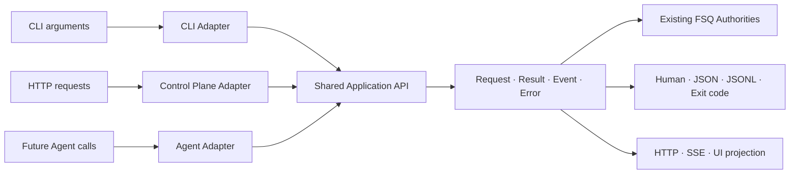

# FSQ 下一代 CLI：团队内部讨论稿

**用途：** 团队讨论与决策同步
**日期：** 2026-08-14
**状态：** 修订后内部 Review

> 本文不是 SPEC、实现依据或最终 API 承诺。完整技术设计见 [FSQ Next-Generation CLI Design](./2026-08-13-next-generation-cli-design.md)。

## 1. 本轮讨论收敛到什么范围

本轮只讨论两件事：

1. FSQ CLI 应该公开哪些接口。
2. CLI、Control Plane 和未来 Coding Agent API 如何共享同一套应用接口。

暂不讨论：

- 每个命令内部的详细流程；
- `case create`、`case test`、`--suggest` 是否对应三个内部 Use Case；
- Run、Environment、Provider 的内部生命周期；
- Application 包内的具体类和文件；
- Extension、Driver、Reporter 的具体插件机制；
- `init` 的具体职责和参数。

## 2. 第一阶段 CLI 接口

```text
fsq
├── init
├── doctor
├── case
│   ├── create
│   └── test
├── ui
├── providers
│   ├── list
│   ├── configure NAME
│   └── status [NAME]
├── runs
│   ├── list
│   ├── show RUN_ID
│   └── logs RUN_ID
└── environments
    ├── list
    └── doctor NAME
```

核心调用：

```bash
fsq case create --platform web --goal "验证搜索功能"

fsq case test --platform web tests/search.fsq.yaml

fsq case test \
  --platform web \
  tests/search.fsq.yaml \
  --suggest
```

## 3. Case 模型

### `case create`

- 输入自然语言 Goal。
- AI 参与真实测试。
- 成功后可以生成 Run-local 的候选 `*.fsq.yaml`。
- 不覆盖已有 Case。

### `case test`

- 输入已有 `*.fsq.yaml` 或 Case 目录。
- Case 是回归测试的执行依据。
- 不修改源 Case。

### `case test --suggest`

- 在测试已有 Case 时请求 AI 建议。
- 可以产生结构化建议和候选 Case。
- 不覆盖源文件。
- 必须保留原始 Case Test 的执行事实，不能把失败静默变成通过。
- 建议阶段的内部时机、状态和拆分暂不讨论。

本轮不再引入：

```text
fsq test
fsq replay
*.intent.yaml
fsq.test-intent/v1
```

新的正式 Case 统一使用：

```text
*.fsq.yaml
```

旧 `*.codex.yaml` 可以保留一个迁移周期，具体期限后续决定。

## 4. Workspace 前置规则

除 `fsq init` 外，所有命令必须在已经初始化的 Workspace 当前目录中运行：

```text
<current-directory>/.fsq-agent-workspace
```

如果不存在或无效：

- 不向父目录查找；
- 不自动初始化；
- 不创建 Run 或外部资源；
- 提示执行 `fsq init`，或者切换到正确目录；
- 结构化错误使用 `workspace.not_initialized`。

> **TODO — Init 单独设计：** 本轮不修改 `init` 的详细职责、参数和 Workspace 创建流程。

## 5. Shared Application Services 到底是什么

确认方向：

> Shared Application Services 既是架构层，也是仓库中的真实 Python Application 包。

它不是一个巨型 `ApplicationService`，也不是只有一张架构图。它向以下入口提供同一套应用接口：

- `fsq` CLI
- Control Plane / `fsq ui`
- 未来 Coding Agent API

接口按资源域组织：

```text
Workspace Operations
Case Operations
Run Operations
Provider Operations
Environment Operations
```

入口共享传输无关的：

```text
Request
Result
Event
Error
```

## 6. CLI 和 UI 如何共用 90%



共同部分是业务语义：

- Workspace 上下文；
- 请求验证；
- Case、Run、Provider、Environment 操作；
- 状态、结果、事件、错误；
- Artifact 引用和安全的下一步建议。

不共同的是传输细节：

| CLI 独有 | UI 独有 |
|---|---|
| Click 参数 | HTTP 请求 |
| stdout/stderr | HTTP Response |
| Human/JSON/JSONL | SSE/UI 投影 |
| 退出码 | HTTP 状态码 |
| SIGINT | 浏览器任务状态 |

Application API 不暴露 Click、HTTP、SSE 或前端类型。

## 7. Application 不重新拥有底层行为

Application 负责“为了完成用户操作，需要组合哪些现有能力”。它不复制这些模块的领域规则：

| 模块 | 继续拥有的规则 |
|---|---|
| Agent | AI 规划、工具编排、动态执行和 Evidence-based verification |
| FSQ | Case YAML/DSL 解析、验证和 canonical step 转换 |
| Core | Capability、参数/Secret 验证、步骤执行、Evidence 策略和 Harness 路由 |
| Report | 从持久化事实生成标准报告和失败分析 |
| Driver | Playwright、UIAutomator2、Appium、pywinauto 等平台操作 |

Application 可以做：

```text
接收 Case Operation → 调用正确模块 → 返回统一 Result/Event/Error
```

Application 不可以做：

```text
再写一套 YAML Parser
直接循环调用 Driver
自己决定截图策略
自己重新解释 pass/fail 报告
自己实现 Agent tool loop
```

## 8. 为什么必须是真实 Python 包

如果 Shared Application Services 只是一层概念，CLI 和 UI 仍可能分别：

- 加载和验证配置；
- 启动 Case；
- 映射状态和错误；
- 查找 Report 与 Evidence；
- 处理 Provider 和 Environment readiness。

行为最终会分叉。真实的 Application 包可以建立强制依赖方向：

```text
CLI ───────────┐
Control Plane ─├──> Application API ──> Existing FSQ modules
Future Agent ──┘
```

底层 Agent、FSQ、Core、Report 和 Driver 不反向依赖 Application。

## 9. 不做巨型 Facade

不建议：

```python
application.execute(command)
```

也不建议一个类包含全部命令。Application Operations 按 Workspace、Case、Run、Provider、Environment 分组。

本轮不决定这些分组内部最终拆成多少 Use Case 或文件。

## 10. Extension 的暂定位置

本轮不设计 Extension API，只记录方向：

- Extension 更可能出现在 Application 下面，例如 Model Provider、Environment Provider、Driver、Report exporter 和受治理的 Capability。
- Extension 不应只增加 CLI 私有业务流程，否则 UI 和 Agent API 无法共用。
- 扩展公开 Application Operation 需要单独设计版本、Schema、权限、发现和安全模型。

第一阶段不公开 Extension 安装或发现命令。

## 11. 机器接口方向

继续保留全局：

```text
--output human|json|jsonl
--non-interactive
```

- JSON 输出最终 Application Result。
- JSONL 输出 Application Events，并以终态 Result 结束。
- Application Error 由 CLI 映射成退出码，由 UI 映射成 HTTP/状态响应。
- Secret 和隐藏推理不得进入任何输出。

## 12. Breaking Changes

| 旧方式 | 新接口 |
|---|---|
| `fsq-agent run --goal ...` | `fsq case create --goal ...` |
| `fsq-agent run --case-yaml ...` | `fsq case test CASE` 或从 Goal 创建 Case |
| `fsq-agent run --strict --case-yaml ...` | `fsq case test CASE` |
| `fsq-agent report --run-id ...` | `fsq runs show RUN_ID` |
| `fsq-agent control-plane` | `fsq ui` |

旧命令不应静默转发。`fsq-agent` 程序名和 `*.codex.yaml` 的具体移除版本后续决定。

## 13. 下一轮需要逐项讨论

框架确认后，再分别讨论：

1. `init` 的职责和 Workspace 创建流程。
2. 每个 CLI 命令的完整参数和行为。
3. `case create` 的内部阶段和候选 Case 规则。
4. `case test --suggest` 的时机、结果状态和 Artifact。
5. Run、Environment 和 Provider 的内部生命周期。
6. Application 包的具体模块、类型和公开 import。
7. Extension、Driver 和 Reporter 的扩展协议。

## 14. 本轮希望团队确认

- 是否接受 `case create` / `case test` 的公共模型；
- 是否确认只保留 `*.fsq.yaml` 新 Case 格式；
- 是否确认 Workspace 当前目录前置规则；
- 是否确认建立真实 Python Application 包；
- 是否确认 CLI、UI、未来 Agent API 共享传输无关契约；
- 是否确认 Application 只编排、不复制现有模块的领域规则；
- 是否确认先定框架，再逐命令讨论内部实现。
